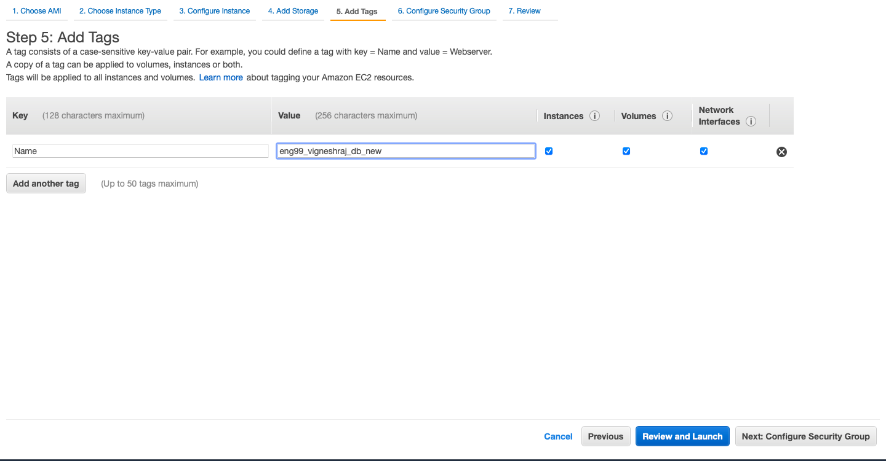
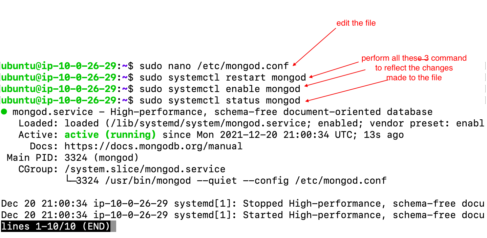
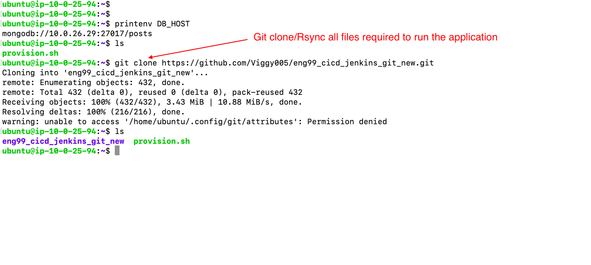
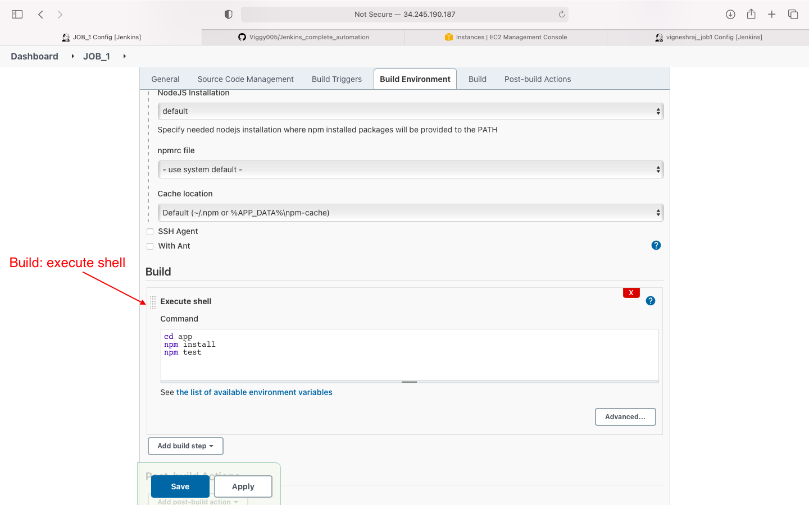

# **Concepts & Tools:**
-  in this project we will be globally deploying our application in a two-tier architecture (internet-facing-app & secure Database)
- create a CI/CD pipeline to make sure the application deployed globally is constantly getting updated as and when changes are made and pushed to github
- **AWS** for infrastructure
- **Jenkins** for automation (CI/CD pipeline)
- **github** as remote repository hold our latest/most recently updated version of application
- **Web-hook** to trigger a jenkins job when changes are pushed to git hub
- **mongodb** for database

# **Project Overview:**
> Infrastructure(AWS):
- We will be hosting 5 Ec2(computer) machines in 4 Subnets within a single VPC

- making sure the Database is  not accessible from the internet (security reasons)
- also give the database access to the internet though a NAT-Instance(to perform updates,etc)
- Jenkins instance to automate the deployment(CI/CD)
-  
> Automation:
- Any contibution/update made to the application and pushed to github will be automatically deployed to the servers running the application using the CI/CD pipeline created using Jenkins.
- Meaning the customers using the application over the intenet will be able to see and experience any of the changes.
- changes can be made by any developer, it will be checked(tested) and merged with the overall project and the new updated version of the overall project will be deployed on AWS infrastructure

# **Infrastructure setup using AWS**
>  **VPC** will be created
>>  4 **subnets** will be created inside the VPC:
 - **Public_subnet**
 -  - Machines hosted in this subnet will be accessible from the intenet directly
 - **Private_subnet**
 - - Machines hosted in this subnet will not be accesable from the internet
 - - however we will provide a **Nat-Instance** so that the machines can acess the intenet(in case they need to perform any software updates)
 - **Jenkins_subnet**
 - **Bastion_subnet** 
>> Each subnet will be attached to **Routing-Table** made for them:
- 1. public_subnet : **public_RT**
- - 1. Destination:10.0.0.0/16, Target:local
- - - - to make sure all traffic from and to instances in same VPC are allowed
- - 2. Destination:0.0.0.0/0, Target: Internet_gateway
- 2. private_subnet : **private_RT**
- - 1. Destination: 10.0.0.0/16, Target: local
- - 2. destination:0.0.0.0/0, Target: Nat_Instance
- - - - to make sure traffic flows to and from nat insatnce(private's access to the internet)
- 3. Jenkins-subnet : **jenkins_RT**
- - 1. Destination:10.0.0.0/16, Target:local
- - 2. Destination:0.0.0.0/0, Target: Internet_gateway
- 4. Bastion_subnet : **bastion_RT**
- - 

>>>> Type of Instances(EC2):
- Public_subnet:
-    1. Internet-facing web app
-  2. Nat-Insance(move .pem file into machine, disable checking source/destination, update Private_RT)
- Private_subnet:
-  3. Database
- Jenkins_subnet:
-  4. EC2 running the Jenkins
- Bastion_subnet:
-  5. Bastion Ec2
>>>> Security_group_ec2
1. Internet-Facing app:
- 1. ssh from local machine
- 2. access to port 3000(this is where the applicaion is running)
2. Nat_Instance:
- 1. ssh from local machine
- 2. All TCP , port 0-65535, source: 0.0.0.0/0 (so that we can peform update inside DB)
- 3. All ICMP-Ipv4 from private_subnet
3.  Database_Insatnce:
-  1. ssh from public_subnet 
-  2. ssh from bastion_subnet
-  3. ssh from jenkins_subnet
-  4. custom TCP, Port:27017, source:public_subnet
-  5. ICMP-IPv4, source: public_subnet
-  6. all traffic, source: public_subnet
4.  Jenkins_Insatnce:
- 1. SSH from local machine
- 2. Custom TCP, port:8080, source:0.0.0.0/0
- 3. HTTP, source:0.0.0.0/0
5. Bastion_insatnce:
- 1. SSH from local machine

# STEPS TO setup AWS Infrastructure:
## STEP 1: create a github repository and clone in into your localhost
## STEP 2: Create The VPC
- Create the VPC(10.0.0.0/16)

## STEP 3: Create Internet gateway and attach to VPC
- Create Internet-Gateway

- attach it to the VPC created

- **NOTE: Dont forget to attach to VPC**

## STEP 4: Create 4 Route Tables and edit routes:
> Public_Subnet_Routing-Table:
- create routing table

- Edit Routes

- choose target as Internet-Gateway

> Private_Subnet_Routing-Table
- create routing table

- Edit Routes

- choose target as Instances

 - **NOTE: Need to edit routes after we create a NAT-Insatnce**
 >Jenkins_Subnet_Routing-Table:
 - create routing table

- Edit Routes

- choose target as Internet-Gateway

>Bastion_Subnet_Routing-Table:
- create routing table

- Edit Routes

- choose target as Internet-Gateway

## STEP 5: Create the Subnets(4) inside the VPC and attach to corresponing RT's
>Public_Subnet:
- create subnet

- select the subnet created

- Navigate to Route Table 
- click on  "edit route table association" and pick created(Public_RT)

>Private_Subnet:
- create subnet

- select the subnet created

- Navigate to Route Table 
- click on  "edit route table association" and pick created(Private_RT)

>Jenkins_Subnet:
- create subnet

- select the subnet created

- Navigate to Route Table 
- click on  "edit route table association" and pick created(Jenkins_RT)

>Bastion_Subnet:
- create subnet

- select the subnet created

- Navigate to Route Table 
- click on  "edit route table association" and pick created(Bastion_RT)

## STEP 6: Create security groups(5)
> Internet-Facing web app running on the Public_subnet:
- select vpc

- Inbound rules

- outbound rules and tag

- confirmation message

> Database running on the private_subnet:
- select vpc

- Inbound rules

- outbound rules and tag

- confirmation message

> Nat-Instance(to give db access to the internet):(dont forget to disable check source/destination)
- select vpc

- Inbound rules

- outbound rules and tag

- confirmation message

>Jenkins-Insatnce
- select vpc

- Inbound rules

- outbound rules and tag

- confirmation message

> Bastion-Instance
- select vpc

- Inbound rules

- outbound rules and tag

- confirmation message

## STEP 7: Launch EC2 Instance into subnets and set up:
> NAT-INSATNCE(public_subnet): 
- the reason to set up nat instance is to give the database acces to the internet to perform updates
- if set up correctly should be able to: 
- - ssh into database from NAT
- - ping www.bbc.com from Database
- - perform "sudo apt-get upgrade" from database

- AMI : should be of NAT, can be found in aws community AMI's
- once created, should disable check source/destination in networking
- - pick the correct AMI

- pick family

- launch into VPC, Public_subnet, enbale public IP

- storage(no changes made)

- add a tag

- pick the security group created for NAT

- choose the appropriate key to launch instance

- **now insatnce is lauched but job not done!!!!**
- 1. disable check source/destination
- 2. copy .pem key needed to shh into DB
- 3. edit Private route table 

- got to VPC dashboard to edit route table

**we are sucessfull if we can SSH into database from NAT-Instance. ping, update for database**

>DataBase(Private_subnet)
- should not be accessable from the internet, hence no public IP is needed
- should be able to acess the internet through NAT-Instance
- pick AMI

- pick family

- select vpc, private_subnet, disable Public IP

- storage(no change)

- Add tag

- select security group created for database

- launch using appropriate key

- SSH into Instance

- make sure ping, update works

- Run provising file to install mongodb

     - provisioning script
        

- make sure mongodb is running(status)

- Edit the mongod.conf file(bindIP)

- restart,enable mongodb

- Git clone/ Rsync a repo with the necessary code to run the application

> Internet-facing-app(public_subnet)
- this ec2 will be launched inside the public_subnet
- will be accessable from the internet
- this is how users will interact with our application
- create environment variable to establish connection with database
- select the AMI

- select the family

- Select the VPC, Public_subnet, enable public IP

- add storage(no changes)

- add tag

- select the security group created for app

- launch the ec2 with correct key

- ssh into the instance

- Provisioing Script

- - the script:
- - 
- edit the .bashrc file and source it(environemnt variable)

- Rsync/Git-clone file required to launch application

- navigate to app.js file-->npm install, npm start

** now the Application is up and Running on AWS provided servers, users from all over the world can access The application and utilize all of its features**

# Automation Using Jenkins
- jenkins is going to be set up to start running a jobs every time an individual-contributer submits their piece of work to GitHub (git push)
- this job that is invoked by a git push using webhook, will further start others jobs
- upon the completion of all the jobs the servers running the application will have all the latest updates and changes made by any individual contibuter  
## Step one: Create a jenkins server on AWS
- will be created inside the jenkins_subnet of the VPC
- should be able to Rsync and SSH into Internet-Facing app(public_subnet) and Database(private_subnet)
- plug-in: Nodejs(also add in config), Git Published, SSH Agent, all the recommended ones
- pick the AMI

- pick the family

- select VPC, Jenkins_subnet, enable public

- add storage(no changes)

- add tag

- choose the jenkins security group

- launch the app with the correct key
- ec2 is launched:

- copy the ssh command

- ssh from local host and run provision file

- now jenkins will be running on port 8080

- copt the public ip of jenkins ec2

> in browser enter "'jenkins_ip':8080"
- get the password from ec2 and paste to proceed

- install suggested plugins

- create user

- Instance configuration(no change)

> install Plug-ins
- navigate to manage jenkins

- naviagte to manage plugins

- in Available install without restart: SSH Agent

- install without restart: nodeJS

- add nodejs in global tool configuration

> create a webhook from github to jenkins
- generate ssh key on local machine(.ssh) using command:
-               ssh-keygen -t ed25519 -C "your_email@example.com"
- generate github key(public & private)

- keys are generated(cat---> copy keys)

- deploy public key on github

- create a webhook on github(add jenkisn IP)
will need to be updated every time jenkins ip changes!!!!!

**NOTE: we have not yet deployed the private key on jenkins, we will do so while creating the first job in jenkins**
## Step 2: set up 4 JOBS on Jenkins:
>JOB 1
- we will be adding the private key of github in this job
- this job is to be triggered as soon as any individual pushes their changes to git hub(to their own branch)
- this job is executed to check if all the files are production ready(the changes made by the individual dont affect the applications ability to pass the tests)
- then finally job2 is invoked if job1 executes sucessfully
- **start creating JOB1**

- select free style project

- general(https code)

- Source code managment: we enter the github private key here

- Build Trigger and Build Environment

- Build 

- post build action(invoke job 2)

**ADD JOB2 to post-build-action:build-other-jobs**
> JOB 2 (Continous Integration)
- this job run if job1 is sucessfull
- this job will merge the dev1 branch to the main branch on github
- the contents of the main branch is what that will get delivered to the servers
- if sucessfull will invoke job3
- we will use git publisher plug in to merge
- **start creating JOB2**

- select freestyle project

- general(https link to github)

- source code management

- post build action(select git publisher)

- if git publised not available add plugin

- post build action: click on add branch

- enter the branch to push changes to

**Add JOB3 in post-build-action: build-other-jobs**
> JOB3 & JOB4 will make the pipeline continous Deployment

> JOB3 (setting up the Database)
- we will be adding the .pem aws key to jenkins in this job so that we can ssh into the instances
- if we are given a new ec2 instance running ubuntu 18.04 and we update this job with the IP address of that instance and run the job, then the ec2 insatnce will be made into a database running mongodb
- any updates made and pushed to git hub will be updated on the database instance that is laready live
- mongo.conf file will be changed
- **start creating JOB3**
- select new item

- select freestyle project

- general

- source code management

- build enivronment(add aws .pem file in ssh agent)

- Build: execute shell(write script)

- post-build-action: build-other-project:job4

**Add JOB3 in post-build-action: build-other-jobs**
> JOB4(setting up the Internet-facing app)
- if we are given a new ec2 instance running ubuntu 18.04 and we update this job with the IP address of that instance and run the job, then the ec2 insatnce will be made into a Internet-Facing web app
- any updates made and pushed to git hub will be updated on the Instance that is already live
- environment varibale will be created by editing the .bashrc file
- environment variable created will be used to link database to app
- **start creating JOB4**
- click on new item

- select freestyle project

- general

- source code management

- build environment(SSH Agent)

- Build: execute shell(edit ip's as they change)
- 2 option: start app maunally or start app from jenkins
- option1: start app manually

- option2: start app from jenkins(need to figure our .bashrc sourcing)

**no down stream jobs for this job**

# Result:
- CI/CD piple for application running on AWS Infrastruture is successful
- Apllication viwed by the customer will always be deployed with all the updates
