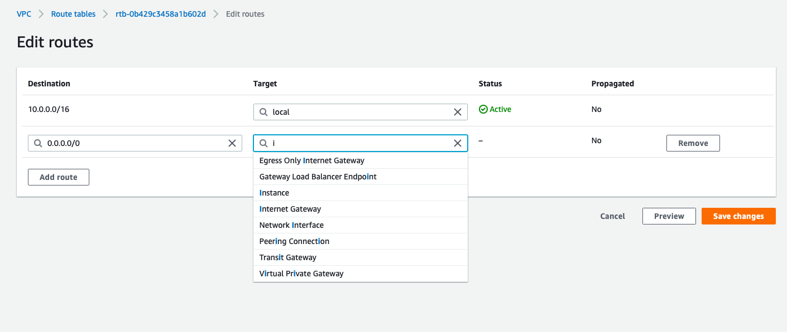

# **Concepts & Tools:**
- in this project we will be hosting our apllication in a two-tier architecture (internet-facing-app & secure Database)
- **AWS** for infrastructure
- **Jenkins** for automation (CI/CD pipeline)
- **github** as remote repository hold our latest/most recently updated version of application
- **Web-hook** to trigger a jenkins job when changes are pushed to git hub
- **mongodb** for database

# **Project Overview:**
- Any contibution/update made to the application and pushed to github will be automatically deployed to the servers running the application using the CI/CD pipeline created using Jenkins.
- Meaning the customers using the application over the intenet will be able to see and experience any of the changes.
- changes can be made by any developer, it will be checked(tested) and merged with the overall project and the new updated version of the overall project will be deployed on AWS infrastructure

# **Infrastructure setup using AWS**
>  **VPC** will be created
>>  4 **subnets** will be created inside the VPC:
 - **Public_subnet**
 -  - Machines hosted in this subnet will be accessible from the intenet directly
 - **Private_subnet**
 - - Machines hosted in this subnet will not be accesable from the internet
 - - however we will provide a **Nat-Insatnce** so that the machines can acess the intenet(in case they need to perform any software updates)
 - **Jenkins_subnet
 - Bastion_subnet 
>> Each subnet will be attached to **Routing-Table** made for them:
- 1. public_subnet : **public_RT**
- - 1. Destination:10.0.0.0/16, Target:local
- - - - to make sure all traffic from and to instances in same VPC are allowed
- - 2. Destination:0.0.0.0/0, Target: Internet_gateway
- 2. private_subnet : **private_RT**
- - 1. Destination: 10.0.0.0/16, Target: local
- - 2. destination:0.0.0.0/0, Target: Nat_Instance
- - - - to make sure traffic flows to and from nat insatnce(private's access to the internet)
- 3. Jenkins-subnet : **jenkins_RT**
- - 1. Destination:10.0.0.0/16, Target:local
- - 2. Destination:0.0.0.0/0, Target: Internet_gateway
- 4. Bastion_subnet : **bastion_RT**
- - 

>>>> Type of Instances(EC2):
- Public_subnet:
-    1. Internet-facing web app
-  2. Nat-Insance(move .pem file into machine)
- Private_subnet:
-  3. Database
- Jenkins_subnet:
-  4. EC2 running the Jenkins
- Bastion_subnet:
-  5. Bastion Ec2
>>>> Security_group_ec2
1. Internet-Facing app:
- 1. ssh from local machine
- 2. access to port 3000(this is where the applicaion is running)
2. Nat_Instance:
- 1. ssh from local machine
- 2. All TCP , port 0-65535, source: 0.0.0.0/0 (so that we can peform update inside DB)
- 3. All ICMP-Ipv4 from private_subnet
3.  Database_Insatnce:
-  1. ssh from public_subnet 
-  2. ssh from bastion_subnet
-  3. ssh from jenkins_subnet
-  4. custom TCP, Port:27017, source:public_subnet
-  5. ICMP-IPv4, source: public_subnet
-  6. all traffic, source: public_subnet
4.  Jenkins_Insatnce:
- 1. SSH from local machine
- 2. Custom TCP, port:8080, source:0.0.0.0/0
- 3. HTTP, source:0.0.0.0/0
5. Bastion_insatnce:
- 1. SSH from local machine

# STEPS TO setup AWS Infrastructure:
## STEP 1: create a github repository and clone in into your localhost
## STEP 2: Create The VPC
- Create the VPC(10.0.0.0/16)

## STEP 3: Create Internet gateway and attach to VPC
- Create Internet-Gateway

- attach it to the VPC created

- **NOTE: Dont forget to attach to VPC**

## STEP 4: Create 4 Route Tables and edit routes:
> Public_Subnet_Routing-Table:
- create routing table

- Edit Routes

- choose target as Internet-Gateway

> Private_Subnet_Routing-Table
- create routing table

- Edit Routes

- choose target as Instances

 - **NOTE: Need to edit routes after we create a NAT-Insatnce**
 >Jenkins_Subnet_Routing-Table:
 - create routing table

- Edit Routes

- choose target as Internet-Gateway

>Bastion_Subnet_Routing-Table:
- create routing table

- Edit Routes

- choose target as Internet-Gateway

## STEP 5: Create the Subnets(4) inside the VPC and attach to corresponing RT's
>Public_Subnet:
- create subnet

- select the subnet created

- Navigate to Route Table 
- click on  "edit route table association" and pick created(Public_RT)

>Private_Subnet:
- create subnet

- select the subnet created

- Navigate to Route Table 
- click on  "edit route table association" and pick created(Private_RT)

>Jenkins_Subnet:
- create subnet

- select the subnet created

- Navigate to Route Table 
- click on  "edit route table association" and pick created(Jenkins_RT)

>Bastion_Subnet:
- create subnet

- select the subnet created

- Navigate to Route Table 
- click on  "edit route table association" and pick created(Bastion_RT)

## STEP 6: Create security groups(5)
> Internet-Facing web app running on the Public_subnet:
- select vpc

- Inbound rules

- outbound rules and tag

- confirmation message

> Database running on the private_subnet:
- select vpc

- Inbound rules

- outbound rules and tag

- confirmation message

> Nat-Instance(to give db access to the internet):(dont forget to disable check source/destination)
- select vpc

- Inbound rules

- outbound rules and tag

- confirmation message

>Jenkins-Insatnce
- select vpc

- Inbound rules

- outbound rules and tag

- confirmation message

> Bastion-Instance
- select vpc

- Inbound rules

- outbound rules and tag

- confirmation message

## STEP 7: Launch EC2 Instance into subnets and set up:
> NAT-INSATNCE(public_subnet): 
- the reason to set up nat instance is to give the database acces to the internet to perform updates
- if set up correctly should be able to: 
- - ssh into database from NAT
- - ping www.bbc.com from Database
- - perform "sudo apt-get upgrade" from database

- AMI : should be of NAT, can be found in aws community AMI's
- once created, should disable check source/destination in networking
- - pick the correct AMI

- pick family

- launch into VPC, Public_subnet, enbale public IP

- storage(no changes made)

- add a tag

- pick the security group created for NAT

- choose the appropriate key to launch instance

- **now insatnce is lauched but job not done!!!!**
- 1. disable check source/destination
- 2. copy .pem key needed to shh into DB
- 3. edit Private route table 

- got to VPC dashboard to edit route table

**we are sucessfull if we can SSH into database from NAT-Instance. ping, update for database**

>DataBase(Private_subnet)
- should not be accessable from the internet, hence no public IP is needed
- should be able to acess the internet through NAT-Instance

